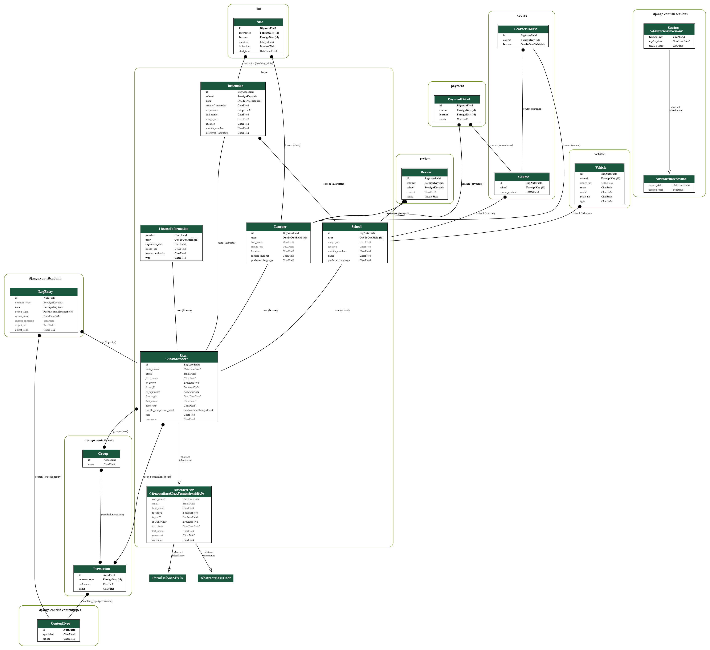

# Notes

- Database url is hardcoded
  
    branches: [vm_*]  
    files: [entrypoint, settings.py]  

- only 1 course allowed per user for now  
- payments to be implemented properly

# TODO

- Test Slots api celery setup

# ER Diagram

# TODO FEATURES

- One School User can create multiple sub accounts with limited permissions to manage the school account.  
- Query Box on school page for learners, can be chatapp or email.  